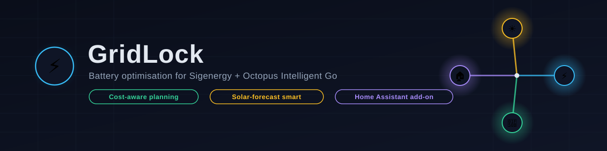
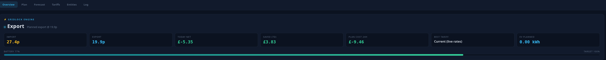

# GridLock v3

Self-contained battery optimisation engine for Sigenergy + Octopus IOG.
A linear-programming planner (PuLP) solves a rolling 48h/96-slot horizon
jointly — rates + IOG dispatches + Solcast + a learned load profile →
charge/export/eco plan, executed every 5 minutes — with three real
operational modes (`eco` / `balanced` / `max_profit`, see
`battery_risk_profile` in apps.yaml), a hard on-peak reserve constraint,
EV (Hypervolt) protection with load separation, Saving Session auto-join
+ force export, Storm Watch (Met Office red warnings, SSEN Power Track
outages, manual toggle), a 15-minute HA/Solcast failsafe deadman switch,
tariff comparison, safe-mode fault handling, and a heartbeat for the
HA-side watchdog.

The optimiser and adapters live in
`gridlock_addon/rootfs/opt/appdaemon/apps/gridlock/core/` as plain,
AppDaemon-free Python — see `tests/` for the unit-test suite
(`pip install "pulp>=2.7,<4" pytest && pytest tests/`, no HA/AppDaemon needed).

## Screenshots

**Overview** — live status, cost/savings tiles, battery progress

## Install (Supervisor add-on)

Bundles its own AppDaemon runtime — no separate AppDaemon add-on
needed. Settings → Add-ons → Add-on Store → ⋮ →
**Repositories** → add `https://github.com/james-autho-tech/gridlock`
→ find "GridLock" → Install. Config lives in
`/addon_configs/gridlock/` once started — see
[gridlock_addon/DOCS.md](gridlock_addon/DOCS.md). If auto-discovery
picks the wrong entity for something (check the web UI's "Discovered
entities" panel), the add-on's own **Configuration** tab has override
fields for it — no YAML editing needed.

If the build fails, check the add-on's Supervisor log first (likely
a stale base-image tag in `gridlock_addon/build.yaml`).

## Running more than one site

`core/config.py`'s `SiteConfig` and the persisted state files (learned
load profile, savings history, decision log, cost tracking) are all
namespaced by the AppDaemon app's own config key — so a second physical
site (a different property, or a second battery) just needs its own
block in `apps.yaml`, using the same `gridlock.py`:

    gridlock_cabin:
      module: gridlock
      class: GridLock
      sigen_mode: select.sigen_plant_remote_ems_control_mode   # the cabin's own entities
      ...

Each block gets its own discovery, its own plan, and its own state files
— nothing is shared between them. On the Supervisor add-on specifically,
the Configuration tab's entity-override fields only ever apply to the
first/primary site block (it's a fixed single-site HA form); a second
block still works, it just can't take overrides from that tab — set any
entities discovery gets wrong for it directly in that block's own
`apps.yaml`, the same as any override.

## Entities published

- `sensor.gridlock_status` (plan_html, action, reason, plus discovered-
  entity attributes including battery_soh_entity, battery_risk_profile,
  battery_degradation_cost, thermal_derate)
- `sensor.gridlock_soc_forecast` (forecast_data, plan_cost_24h, learned_load_profile)
- `sensor.gridlock_target_soc`
- `sensor.gridlock_tariff_compare` (compare_html)
- `sensor.gridlock_calculated_net_cost_today` (import/export cost —
  real Octopus billing data when available, GridLock's own live-tracked
  calculation as a fallback and always-shown cross-check otherwise)
- `sensor.gridlock_ssen_local_outages`
- `sensor.gridlock_heartbeat`
- `sensor.gridlock_ev_dispatch_kwh` (planned_kwh, completed_kwh)
- `sensor.gridlock_decision_log` (entries — timestamped state changes)
- `sensor.gridlock_solar_forecast` (forecast_data, today_kwh, tomorrow_kwh)
- `sensor.gridlock_storm_status` (reason)
- `sensor.gridlock_savings` (today, week, month, all_time — £ actually
  saved vs a self-consumption-only baseline; daily_cost_history —
  last 28 days' real spend; plan_accuracy — most recent day's morning
  forecast vs actual outcome; profile_comparison_history/_totals —
  what each battery_risk_profile's own morning plan predicts, day by
  day and summed)
- `sensor.gridlock_carbon_intensity` (GB grid carbon intensity, gCO2/kWh,
  from National Grid ESO's public API — informational only, not
  factored into cost planning)

## Hardware support

Built and tested against Sigenergy only — that's the only inverter this
has ever actually controlled. `core/registry.py`'s `HASensorRegistry`
also recognises GivTCP (GivEnergy) and Solis naming conventions for
**read-only telemetry discovery** (SoC, capacity, power), but
`core/inverter.py`'s adapters for those two raise rather than guess at
unverified `select`/`number` service-call semantics for a real battery
inverter — this project exists specifically to avoid mis-stating a real
inverter's control mode, so it won't fabricate a control mapping it
can't test. PRs adding a verified GivTCP/Solis control adapter are welcome.

## License

Personal, non-commercial use only — see [LICENSE.md](LICENSE.md).
Forks/PRs on GitHub are welcome; redistribution elsewhere or
commercial use needs permission first.
